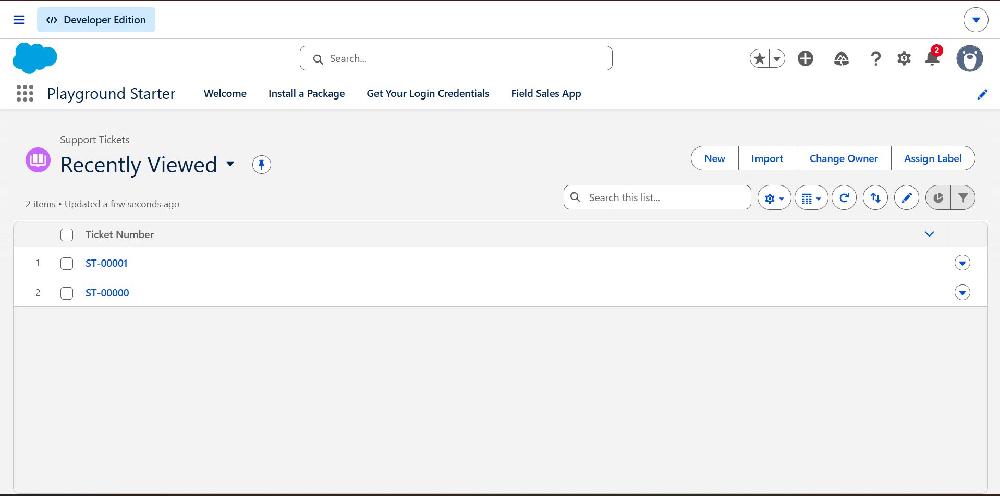
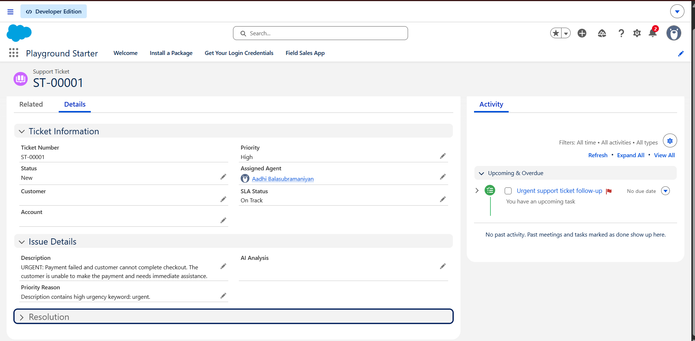
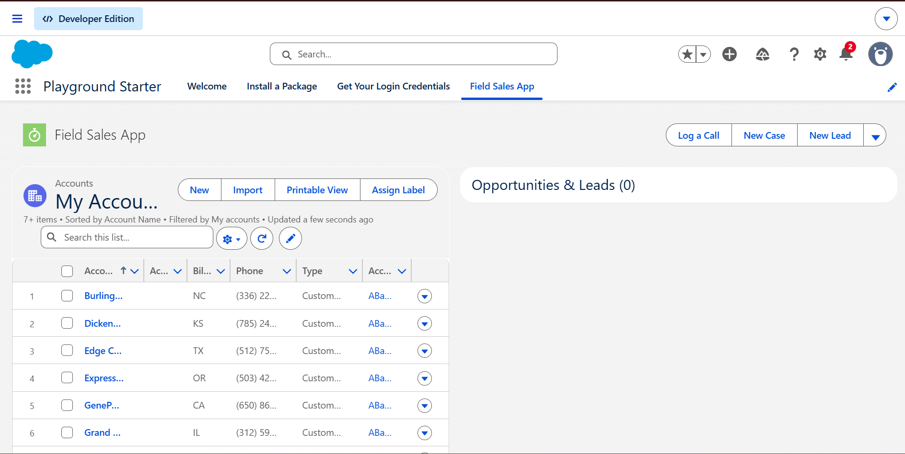
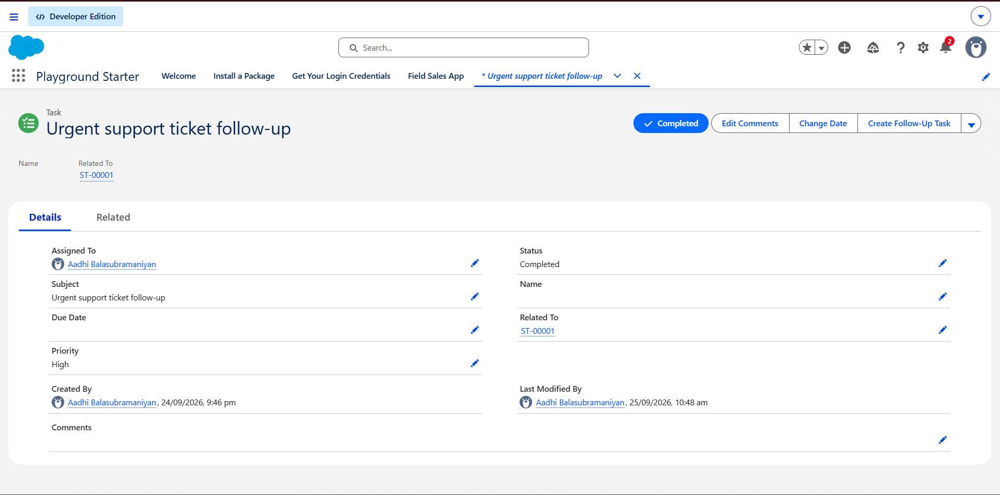

# Customer Support Ticket Intelligence

Salesforce DX source for a support-ticket prioritization and assignment application. The project uses a custom `Support_Ticket__c` object, Apex classification, least-loaded agent assignment, and a record-triggered Flow that creates one urgent follow-up Task for each high-priority ticket.

## What is included

- Support Ticket object with customer/account, description, status, priority, priority reason, assigned agent, SLA, AI analysis, and resolution fields.
- Bulk-oriented Apex priority classifier and agent assignment service.
- Active record-triggered Flow for idempotent high-priority Task creation.
- All, High Priority, Open, My Assigned, and Recently Created list views.
- Support agent permission set; assign it only to approved support agents.
- Lightning app navigation and a base record page definition.
- Agentforce setup guide and UI configuration instructions.

## Setup

1. Install Salesforce CLI and authenticate to a **sandbox**: `sf org login web --alias support-dev --instance-url https://test.salesforce.com`.
2. Assign `Support_Ticket_Agent` to intended ticket agents before testing automated assignment.
3. Validate: `sf project deploy validate --source-dir force-app --target-org support-dev --test-level RunLocalTests`.
4. Deploy: `sf project deploy start --source-dir force-app --target-org support-dev`.
5. Assign the `Support_Ticket_Agent` permission set to agents; assign object access to other intended users through a separately reviewed permission set/profile.
6. Complete the Lightning App Builder steps in [UI/UX guide](docs/ui-ux.md), since dashboard reports and page activation depend on the org's data and app assignments.

## Screenshots

### Support Ticket List
Shows the Salesforce Support Tickets object with created support ticket records.

### Support Ticket Details
Shows the Support Ticket record including ticket number, priority, status, assigned agent, SLA status, description, AI analysis, and priority reason.

### Salesforce Field Sales App
Shows the Salesforce Field Sales App interface and CRM functionality.

### Automated Follow-up Task
Shows the automated urgent support ticket follow-up task associated with Support Ticket `ST-00001`.

## Important implementation details

Priority classification runs before insert/update and overwrites the priority from the current description. Assignment runs on insert only when no agent is supplied; it selects the lowest open-ticket count among active users assigned the designated agent permission set. If there are no designated agents, the ticket remains unassigned. The Flow runs after save, creates a Task once, and sets an idempotency flag. Agentforce features require org licensing and admin configuration; follow [docs/agentforce.md](docs/agentforce.md).

See [deployment](docs/deployment.md), [architecture](docs/architecture.md), and [requirements](docs/requirements.md) for operational detail.
